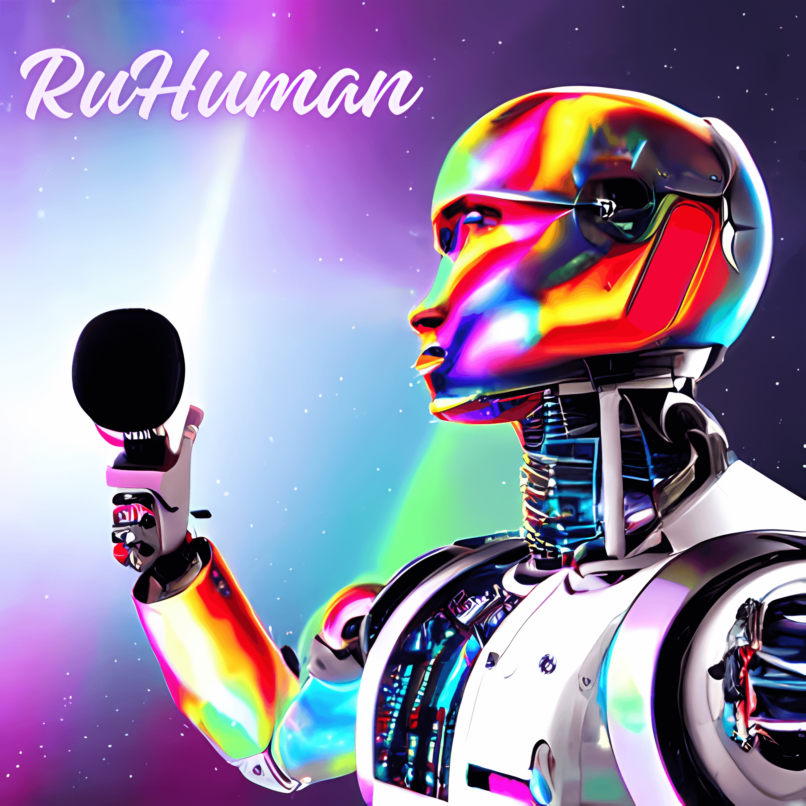

# RuHuman: A Resilient Multimodal AI-Powered Audio Verification System 

## Checkout the Demo!

  

## Abstract
The advent of generative AI is inevitable when generating synthetic data to bypass certain human verification systems. The objective of RuHuman is to evaluate/refine existing verification systems presented in ASVSpoof that exploit the multimodalities of audio data in order to establish a strong multi-factored conviction on deciding if the input is being lively uttered by a human or by an audio deepfake. The plan is generate samples with top of the line software in voice cloning (e.g. TortoiseTTS), then evaluate the standard CM/ASV metrics among different pretrained detector architectures with the ASVSpoof2021 evaluation set & make a adaptable user interface that allows any wireless device with a microphone employ these systems in versatile environments.

## Team
Authors: [Timothy Do](https://timothydo.me)  
Course: Fall 2023 ECE202A Embedded Systems @ UCLA  
Instructor: Professor [Mani Srivastava](https://www.ee.ucla.edu/mani-srivastava/)  

## Required Submissions 
[Project Proposal](https://github.com/dotimothy/RuHuman/blob/main/Proposal.md)  
[Midterm Checkpoint Slides](https://github.com/dotimothy/RuHuman/blob/main/docs/media/RuHuman_Midterm.pdf)  
[Final Report](https://github.com/dotimothy/RuHuman/blob/main/Report.md)  
[Final Slides](https://github.com/dotimothy/RuHuman/blob/main/docs/media/RuHuman_Final.pdf) 

## Usage 
The project source code root directory is under [<code>./projects/audio/</code>](https://github.com/dotimothy/RuHuman/tree/main/projects/audio).

  

