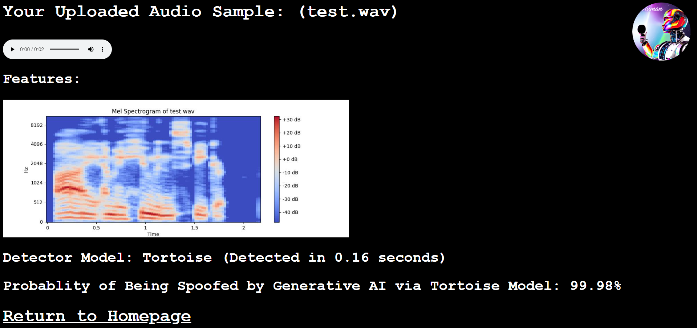

# Final Report
# Table of Contents
* [Abstract](#abstract)
* [Introduction](#1-introduction)
* [Related Work](#2-related-work)
* [Technical Approach](#3-technical-approach)
* [Evaluation and Results](#4-evaluation-and-results)
* [Discussion and Conclusions](#5-discussion-and-conclusions)
* [References](#6-references)

# Abstract
The advent of generative AI is inevitable when generating synthetic data to bypass certain human verification systems. The objective of RuHuman is to evaluate/refine existing verification systems presented in ASVSpoof that exploit the multimodalities of audio data in order to establish a strong multi-factored conviction on deciding if the input is being lively uttered by a human or by an audio deepfake. The technical approach is to generate samples with top of the line software in voice cloning (e.g. TortoiseTTS), then evaluate the standard CM/ASV metrics among different pretrained detector architectures with the ASVSpoof2021 evaluation set & make a adaptable user interface that allows any wireless device with a microphone employ these systems in versatile environments.

# 1. Introduction
The advent of generative AI is inevitable when generating synthetic data to bypass certain human verification systems. With advancements in audio deepfakes, human pereption in distinguishing a real human speaker (bonafide) from an audio deepfake (spoof) is rapidly increasing in complexity. This is unfourtanely seen in the growing number of audio deepfake crimes, including a [recent story](https://www.youtube.com/watch?v=Dfo2MMGZTvU) on the news highlighting a mother almost being scammed out of $15,000 from a deepfake of her daughter being kidnapped. The assistance of an automated AI-powered audio verification that's easily accessible is essential for mitigating more people from falling victim of these schemes.

The objective of RuHuman is to evaluate/refine existing verification systems that exploit the multimodalities of audio data in order to establish a strong multi-factored conviction on deciding if the input is being lively uttered by a human or by some other medium (e.g. recording playback or synthesized with generative AI). Additionally, the project aims to be easily accessible to the general public, being able to be employed on any client wireless device that has a microphone. This makes liveness detection versatile in many environments such as robocalls & virtual interviews.

Audio ASVSpoof (Automatic Speaker Verification and Spoofing Countermeasure Challenge) [1] is a dedicated challenge that gathers researchers from around the world to developing audio spoofing pipelines. The two problems explored in this challenge are Logical Access (LA) attacks (Speech Synthesis/Voice Conversions) and Physical Attacks (PA) (Replay through Speaker). RuHuman will mainly being focused on systems that participate in LA type tasks. Researchers have presented audio encoding schemes such as MFCC (Mel-frequency cepstral coefficients) & Spectrograms to augment training their classifiers for detection [2]. The limits of the practice is that some datasets used for training in the competition were in a controlled environment, which limits the effect of alternative additive sources in real-world applications (e.g. noise, multi-speakers, nature) [3].

RuHuman investigates how additive noise sources effect the performance of systems by injecting them with the audio sample before testing. If this project yields success, the approach should indicate to researchers in the ASVspoof competition that the technical factors of additive sound sources is imperative for training their submissions in real-world environments. On a more broader sense, the user interface that will be implemented should make it easy for the general public to assess if their audio files were bonafide. They should be able to access audio liveness detection from a large range of computing: from a smartphone to an audio workstation.

Potential challenges when evaluating these audio liveness detection systems come from advanced spoof attacks such as multi-speakers. For instance, a bonafide speaker can utter a words for the first few seconds in the sample, and then generative AI can synthesize the rest of the audio, leading to the system potentially classifying the sample only based on the initial audio samples. Another way for a potential spoof is if a human and generative AI spoke concurrently, it can produce a hidden set, potentially leading to a false positive classification. 

In the development of this project, a strong command of Digital Speech Processing is required when working with analysis of audio files. Specifically, knowledge of STFT (short-time Fourier Transform) and other frequency based audio encodings will be applied in many of these implementations. Knowledge of neural network architectures are useful for training the detector to infer on real-world audio samples. Hardware resources to development RuHuman are NVIDIA GPU(s) with high VRAM (e.g. NVIDIA RTX 3090) for their acceleration improvements performing convolution. Software resources for RuHuman include PyTorch [4] & MATLAB which is the code baseline for many of the deepfake voice detectors/synthesizers. The program dependencies of this project are the various deepfake voice cloning programs (e.g. Tortoise [5]) and detectors from ASVSpoof.

The success for evaluating each of the models of ASVSpoof is to evaluate them against the tandem detection cost function (t-DCF) [6] formulated by the authors of ASVSpoof. It is a metric which involves predefined ASV scores (from organizers), prior probablities of speakers, and CM scores from a respective detector. Secondary metrics to evaluate success with be the equal error rate (EER) and computation time of each submission. The objective is to minimize these metrics for efficiency and accuracy. These metrics will be computed with respect to the augmented dataset mentioned previously.

# 2. Related Work

There have been work in ASVSpoof submissions that fuse multiple audio encoding models together in order to further minimize t-DCF and EER metrics. Specifically, an ASVSpoof2019 submission from UCLA NESL (Network and Embedded Systems Laboratory) implemented residual neural networks using ResNet blocks as a countermeasure system [2]. The input features being embedded are from either log-STFT (for Spectrograms), MFCC, or CQCC transforms. With each individual ResNet model alone (i.e. Spec-ResNet, MFCC-ResNet, & CQCC-ResNet), the pooled t-DCF and EER metrics only scored higher than the baseline models (i.e. LFCC-GMM, CQCC-GMM) on the ASVSpoof2019 LA evaluation set. However, when their ResNets models were fused, it resulted in approximately 25% improvement from the baseline models with <code>t-DCF = 0.1569</code> & <code>EER = 6.02</code>. The takeaway is that combining multiple models with different audio modalities together produce a strong multi-factored countermeasure for audio speaker verification. 

# 3. Technical Approach

The first phase of RuHuman is an evalatory phase with some of the baseline ASVSpoof models. First, each baseline model was worked out to evaluate the CM scores of the 2021 ASVSpoof evaluation set to generate the pooled t-DCF and EER scores seen in the organizer's results [1]. Then, additive white gaussian noise with a signal to noise ratio of 50 was injected in each audio sample to generate a more 'in-the wild' sample that simulates a noisy channel. Afterwards, the CM scores, t-DCF, and EER metrics are recomputed to compare on AWGN effects performance of the baseline system's countermeasurablity.

The second phase of RuHuman is an implementation phase of it's user interface to serve gateway devices. First, audio samples need to be sent from client to server through an HTTP POST request to run the verification pipeline. Secondly, the audio detector models are called upon with an argument to the path of the audio sample to be verified. Finally, a dashboard is created showcasing audio encoded features and spoofing probablities to the user. The cloud computer that hosts the Python Flask Server with Classification Backends is equipped with an NVIDIA RTX 3080 GPU.

## Overview of Cloners
Tortoise [5]
Apple Personal Voice [7]

## Overview of Detectors

## Overview of User Interface

# 4. Evaluation and Results

## Phase 1: Evaluation of Metrics:
### Accuracy: t-DCF & EER
Tabulated Below are Pooled t-DCF and EERs for the 2021 ASVSpoof Evaluation Set for it's Baseline Models with & without AWGN:

| Detector Architecture (Normal)  | Pooled t-DCF | Pooled EER (%)
| ------------- | ------------- | ------------- |
| Baseline LFCC-GMM (MATLAB)  | 0.5758  | 19.30  |
| Baseline CQCC-GMM (MATLAB)  | 0.4964  | 15.62  |
| Baseline RawNet2 (MATLAB)  | 0.4255  | 9.49  |

| Detector Architecture (AWGN)  | Pooled t-DCF | Pooled EER (%)
| ------------- | ------------- | ------------- |
| Baseline LFCC-GMM (MATLAB)  | 0.8527  | 41.33  |
| Baseline CQCC-GMM (MATLAB)  | 0.7609  | 31.99  |
| Baseline RawNet2 (MATLAB)  | 0.3317  | 7.23  |

The full raw CM Scores that generated the above metrics using <code>eval-package</code> can be found in the [results](https://github.com/dotimothy/RuHuman/tree/main/docs/results) folder of this repository.

### Effciency: Computation Time
Tabulated Below are Average Computation Times for verifying a sample from the ASVSpoof2021 dataset. For context, each audio sample is approximately 3-5 seconds in length.

| Detector Architecture  | Average Computation Time (s) |
| ------------- | ------------- 
| Tortoise Audio Mini Encoder (Python)  | 0.22  |
| Baseline LFCC-GMM (MATLAB)  | 0.18  | 
| Baseline CQCC-GMM (MATLAB)  | 0.27  | 
| Baseline RawNet2 (Python)  | 0.30  | 

## Phase 2: Implementation of User Interface
The user interface has been completed and is showcased in the following YouTube video: 
[https://youtu.be/KU3gJ5L9Puw](https://youtu.be/KU3gJ5L9Puw) 

  

# 5. Discussion and Conclusions

From the primary evaluation of metrics in phase 1, it is indicative that additive noise can be injected to enhance an adversarial spoofing attack to being successful. For the GMMs with LFCC/CQCC embeddings, the rates for pooled t-DCF and EER increased by 48.8/53.2% and 114.1/104.8% respectively. An interesting observation is that the RawNet2 rates for pooled t-DCF and EER actually decreased by 22% and 23.8% when AWGN was applied to the evaluation set. Perhaps this is due to the initial layer of Mel Sinc Filters which mitigated the effect of the AWGN before passing through the Res blocks. On an efficiency note, all the detectors were able to predict an audio sample within less than a second, making them usable for liveness detection. Finally, the user interface was deployed and tested to be easily accesible from gateway devices.

Future actions can be to take isolating noise sources as a preprocessing step to prevent it from being sent to the detectors. Noise should be mitigated as a factor when a CM score is computed for a specific utterance. Another application from this project is to forward the classifier outputs to an embedded control system (e.g. turning a light red/green on whether the sample is spoofed/bonafide) for performative action which requires liveness detection. Finally, RuHuman's audio verification can be fused with other modalities of liveness detection (i.e. video deep fake detection) for a complete system for detecting deepfakes. The advent of audio generative models is advancing rapidly with state of the art deepfakes, thus a complement of a multi-modal discriminator for distinguishing bonadife or spoof is imperative, which is what RuHuman strives to achieve.  

# 6. References

[1] X. Liu et al., "ASVspoof 2021: Towards Spoofed and Deepfake Speech Detection in the Wild," in IEEE/ACM Transactions on Audio, Speech, and Language Processing, vol. 31, pp. 2507-2522, 2023, doi: 10.1109/TASLP.2023.3285283.

[2] M. Alzantot, Z. Wang, and M. B. Srivastava, "Deep Residual Neural Networks For Audio Spoofing Detection," 2019, arXiv:1907.00501.

[3] Yamagishi, Junichi; Todisco, Massimiliano; Sahidullah, Md; Delgado, Héctor; Wang, Xin; Evans, Nicolas; Kinnunen, Tomi; Lee, Kong Aik; Vestman, Ville; Nautsch, Andreas. (2019). ASVspoof 2019: The 3rd Automatic Speaker Verification Spoofing and Countermeasures Challenge database, [sound]. University of Edinburgh. The Centre for Speech Technology Research (CSTR). https://doi.org/10.7488/ds/2555.

[4] A. Paszke et al., "PyTorch: An Imperative Style, High-Performance Deep Learning Library", in Proceedings of the 33rd International Conference on Neural Information Processing Systems, Red Hook, NY, USA: Curran Associates Inc., 2019.

[5] J. Betker, ‘Better speech synthesis through scaling’, arXiv [cs.SD]. 2023.

[6] T. Kinnunen et al., "t-DCF: a Detection Cost Function for the Tandem Assessment of Spoofing Countermeasures and Automatic Speaker Verification", arXiv [eess.AS]. 2019.

[7] "Apple previews Live Speech, Personal Voice, and more new accessibility features," Apple Newsroom, https://www.apple.com/newsroom/2023/05/apple-previews-live-speech-personal-voice-and-more-new-accessibility-features/.

[8] M. Todisco, H. Delgado and N. Evans, "Constant Q cepstral coefficients: a spoofing countermeasure for automatic speaker verification", Computer, Speech and Language, vol. 45, pp. 516 –535, 2017.

[9] H. Tak, J. Patino, A. Nautsch, N. Evans, M. Todisco, "Spoofing Attack Detection using the Non-linear Fusion of Sub-band Classifiers" in Proc INTERSPEECH, 2020.

[10] H. Tak, J. Patino, M. Todisco, A. Nautsch, N. Evans, and A. Larcher, ‘End-to-End anti-spoofing with RawNet2’, in IEEE International Conference on Acoustics, Speech and Signal Processing (ICASSP), 2021, pp. 6369–6373.